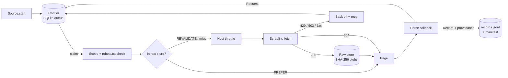

<div align="center">

# harvester

**Polite, reproducible web harvesting. Fetch once, parse forever.**

[](https://github.com/sarthak213/harvester/actions/workflows/ci.yml)
[](https://www.python.org)
[](LICENSE)
[](https://mypy-lang.org)

</div>

Most scrapers are throwaway scripts. They re-download everything whenever a parser changes, start over after a crash, hammer servers until they get blocked, and produce data nobody can trace back to its source.

**harvester** treats harvesting as a data pipeline. Every response goes into a content-addressed store, so parsers can be fixed and re-run **offline**. The crawl queue lives on disk, so interrupted runs **resume** where they stopped. Politeness is built into the engine, not left as an afterthought. Every record carries its **provenance and licence**.

It uses [Scrapling](https://github.com/D4Vinci/Scrapling) for fetching and parsing, and adds the engine around it.

```text
┌──────────────────────────── quotes | crawl ─────────────────────────────┐
│      60   pages        150   records      60   fetched   0   from cache │
│       0   queued         0   retries       0   failed    0   blocked    │
│ 272.5 KB  downloaded    93   pages/min   39s   elapsed   0   skipped    │
└─────────────────────────────────────────────────────────────────────────┘
complete run 20261003T044028Z
  records: 50 author, 100 quote
```

## Highlights

| | |
|---|---|
| **Fetch once, parse forever** | Raw responses are stored gzip-compressed and keyed by SHA-256. `harvester reparse` replays the whole crawl graph from disk with **zero network requests**, so fixing a parser never costs another crawl. |
| **Resumable by design** | The frontier is a SQLite queue. Ctrl+C (or a crash, or a reboot) loses nothing; the next `run` continues where it stopped. |
| **Polite by default** | robots.txt per RFC 9309, including its 4xx/5xx rules and `Crawl-delay`. Per-host rate limits and concurrency caps. `Retry-After` honoured. The delay adapts, backing off on 429/503 and recovering slowly. |
| **Honest** | Requests carry a real User-Agent with a contact URL. Scrapling's browser impersonation and header forging are **turned off**. |
| **Smart caching** | Each request picks a cache policy: documents are fetched once, listings are revalidated with `If-None-Match` / `If-Modified-Since`, and a `304` reuses the stored body. |
| **Provenance and licensing** | Every record states its source URL, fetch time, content hash, parser version and the data's licence. Every run writes a manifest. |
| **Change tracking** | The store keeps a history of every fetch. `harvester changes` lists pages whose content changed between crawls. |
| **Bulk-data connectors** | Built-in **OAI-PMH** and **DSpace 7+** sources cover thousands of libraries, archives and government repositories. Downloads are verified against published MD5s. |
| **Small API** | A source is a class with a start URL and a parse method. Load one from a file, or publish it as a plugin through entry points. |

## Quick start

```bash
pip install "git+https://github.com/sarthak213/harvester"

harvester run examples/quotes.py          # crawl the scraping sandbox
harvester reparse examples/quotes.py      # rebuild every record offline
harvester status examples/quotes.py       # queue, store and run history
```

Output lands in `.harvester/<source>/runs/<run-id>/records.jsonl`, one record per line:

```json
{
  "kind": "author",
  "id": "Albert-Einstein",
  "data": {"name": "Albert Einstein", "born": "March 14, 1879", "born_in": "in Ulm, Germany"},
  "provenance": {
    "source": "quotes",
    "url": "https://quotes.toscrape.com/author/Albert-Einstein/",
    "fetched_at": "2026-10-03T04:41:36Z",
    "sha256": "9d1c…",
    "status": 200,
    "parser_version": "1",
    "harvester_version": "0.1.0",
    "license": {"name": "Scraping sandbox by Zyte; sample data"}
  }
}
```

## Writing a source

```python
from harvester import CachePolicy, Page, Request, Source


class Quotes(Source):
    name = "quotes"
    start_urls = ("https://quotes.toscrape.com/",)
    allowed_domains = ("quotes.toscrape.com",)

    def start(self):
        # Listings change, so revalidate them on each pass.
        yield Request(url=self.start_urls[0], cache=CachePolicy.REVALIDATE)

    def parse(self, page: Page):
        for quote in page.css("div.quote"):
            yield page.record(
                "quote",
                id=quote.css("span.text::text").get(),
                author=quote.css("small.author::text").get(),
                tags=quote.css("a.tag::text").getall(),
            )
        if next_href := page.css("li.next a::attr(href)").get():
            yield page.follow(next_href, cache=CachePolicy.REVALIDATE)
```

`harvester new my-site` scaffolds one. Callbacks receive a `Page`, which offers CSS/XPath via Scrapling, `.json()` and `.text`. They yield `Request`s to follow and `Record`s to keep. The one rule: **callbacks must not do their own I/O**. Keeping them pure is what makes offline re-parsing exact.

See [docs/writing-sources.md](docs/writing-sources.md) for options, multiple callbacks, file downloads and packaging a source as a plugin.

## How it works



```text
.harvester/<source>/
├── frontier.sqlite        # queue: pending / done / failed / skipped, retries, priorities
├── store/
│   ├── index.sqlite       # latest response per URL + full fetch history
│   └── blobs/ab/cd/…gz    # bodies, content-addressed and deduplicated
└── runs/<run-id>/
    ├── records.jsonl      # output
    └── manifest.json      # settings, stats, licence, outcome
```

## Built-in sources

| Source | What it harvests |
|---|---|
| `oai-pmh` | Any [OAI-PMH 2.0](https://www.openarchives.org/OAI/openarchivesprotocol.html) repository: `ListRecords` with resumption tokens, deleted records, any metadata format. `-o base_url=… -o set=… -o metadata_prefix=…` |
| `dspace` | Any DSpace 7+ repository via its REST API: items, then files from chosen bundles, MD5-verified, with text files inlined. `-o base_url=… -o scope=<uuid> -o bundles=ORIGINAL` |
| `india-code` | India's central Acts from [India Code](https://indiacode.gov.in): clean act records (number, year, ministry, enforcement date, repeal status) plus the official text extraction. `-o in_force_only=true -o pdf=true` |

## CLI

| Command | |
|---|---|
| `harvester run SOURCE [-o k=v] [--limit N] [--delay S] [--refresh] [--restart]` | Crawl. Resumes interrupted work; otherwise starts a new pass that reuses the cache. |
| `harvester reparse SOURCE` | Re-run parsers over the raw store. No network. |
| `harvester status SOURCE` | Queue counts, store size, failures with reasons, recent runs. |
| `harvester changes SOURCE` | URLs whose content changed between fetches. |
| `harvester show URL -s SOURCE [--save FILE]` | Inspect or extract a stored response. |
| `harvester robots URL` | Explain whether a URL may be fetched, and why. |
| `harvester list` / `harvester new NAME` | Installed sources / scaffold a new one. |

`SOURCE` is an installed source name, `path/to/file.py`, or `path/to/file.py:ClassName`.

## Politeness, precisely

harvester is meant for collecting data you are entitled to collect, without being a burden on the sites that host it.

- **robots.txt (RFC 9309).**
  - `2xx`: rules and `Crawl-delay` are obeyed.
  - `4xx`: no restrictions.
  - `5xx` or network error: **complete disallow**.
  - A source may opt out of that last rule only by declaring `robots_unavailable = "allow"` *with a written reason*. The choice is recorded in every run manifest.
- **Rate limits.** Per-host minimum delay (default 1 s) and concurrency (default 1). On `429`/`503` the delay doubles, honouring `Retry-After`. It recovers by 10% per healthy response.
- **Identity.** `harvester/<version> (+https://github.com/sarthak213/harvester)`. Change it with `--user-agent`, but keep a contact URL in it.
- **No evasion.** No browser fingerprint spoofing, no CAPTCHA solving, no proxy rotation to get around blocks. If a site says no, harvester listens.

## Development

```bash
git clone https://github.com/sarthak213/harvester && cd harvester
python -m venv .venv && . .venv/bin/activate        # Windows: .venv\Scripts\activate
pip install -e ".[dev]"
pytest                   # 41 tests, including a real HTTP server for end-to-end runs
ruff check . && ruff format --check . && mypy src
```

## Roadmap

- Browser rendering for JavaScript-only pages (Scrapling `DynamicFetcher`), opt-in per request
- Sitemap and RSS/Atom discovery sources
- Parquet / SQLite export with record de-duplication across runs
- Scheduled incremental runs and change notifications
- More open-data connectors: CKAN, Zenodo, S3 open-data buckets

## License

MIT. See [LICENSE](LICENSE). The licence covers harvester's code. **The data you harvest has its own terms**; sources declare them, and harvester records them in every output.
